# Azure Active Directory Enterprise Homelab

Enterprise-style Active Directory environment built in Microsoft Azure demonstrating centralized identity management, Windows Server administration, DNS configuration, Group Policy management, organizational unit design, endpoint administration, and security policy implementation.

---

# Project Overview

This project demonstrates the deployment and administration of an enterprise-style Windows Active Directory environment hosted entirely within Microsoft Azure. The lab was designed to simulate many of the day-to-day responsibilities performed by IT Support Specialists, Systems Administrators, and Infrastructure Engineers in a production environment.

The environment consists of a Windows Server 2022 Domain Controller and a Windows 11 Enterprise client connected through an Azure Virtual Network. Active Directory Domain Services (AD DS), DNS, Organizational Units (OUs), Security Groups, Group Policy Objects (GPOs), and centralized authentication were configured to create a functional domain environment.

Throughout the project, configuration changes were validated using PowerShell, Active Directory administrative tools, Group Policy reporting, and authentication testing to ensure each component functioned correctly.

---

# Objectives

- Deploy an Active Directory environment in Microsoft Azure
- Configure Active Directory Domain Services (AD DS)
- Create a new Active Directory forest (westonlab.local)
- Configure DNS services
- Design a scalable Organizational Unit structure
- Create users and Security Groups
- Join a Windows client to the domain
- Configure Group Policy Objects
- Implement workstation security policies
- Configure account lockout policies
- Validate authentication and policy enforcement
- Demonstrate enterprise troubleshooting techniques

---

# Technologies Used

### Cloud

- Microsoft Azure
- Azure Virtual Machines
- Azure Virtual Network
- Azure Network Security Groups

### Operating Systems

- Windows Server 2022
- Windows 11 Enterprise

### Active Directory Services

- Active Directory Domain Services
- DNS Server
- Active Directory Users and Computers
- Group Policy Management

### Administration

- PowerShell
- Remote Desktop Protocol (RDP)
- Server Manager
- Windows Administration Tools

### Networking

- DNS
- IPv4
- Azure Virtual Networking

---

# Skills Demonstrated

- Active Directory Administration
- Windows Server Administration
- Azure Infrastructure
- DNS Configuration
- Group Policy Management
- Organizational Unit Design
- Security Group Administration
- Endpoint Administration
- Domain Authentication
- Remote Desktop Administration
- PowerShell Validation
- Account Lockout Policy Configuration
- Enterprise Troubleshooting
- Technical Documentation

---

# Architecture

The environment consists of a Windows Server 2022 Domain Controller and a Windows 11 Enterprise client deployed within the same Azure Virtual Network.

The Domain Controller hosts Active Directory Domain Services and DNS while the client workstation authenticates against the domain and receives centralized Group Policy configuration.

---

# Project Walkthrough

## 1. Deploying the Domain Controller

Windows Server 2022 was deployed as the primary Domain Controller for the environment. Active Directory Domain Services and DNS Server were installed before promoting the server to the first Domain Controller in the new **westonlab.local** forest.

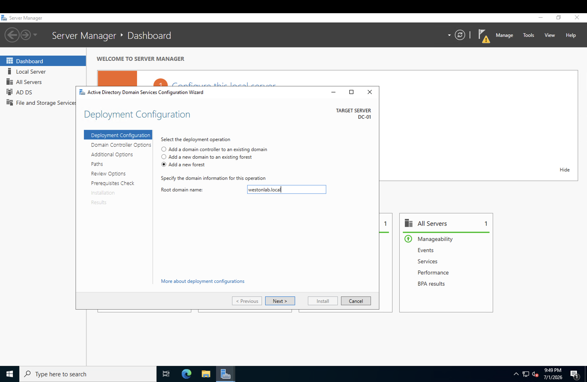

After deployment, Server Manager confirms that Active Directory Domain Services and DNS are successfully installed.

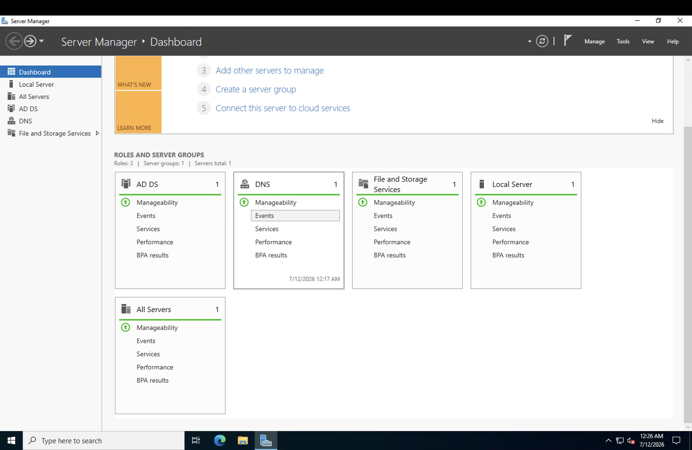

---

## 2. DNS Configuration

DNS is critical to Active Directory authentication. The Domain Controller hosts the Forward Lookup Zone for **westonlab.local**, allowing clients to locate domain services and authenticate correctly.

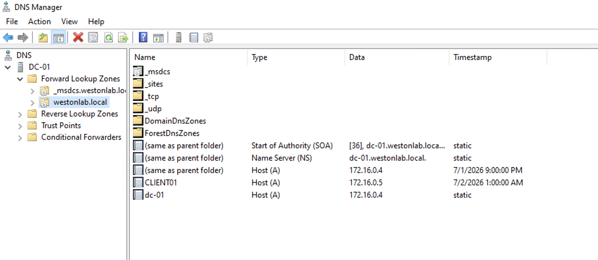

---

## 3. Organizational Unit Design

To simulate a multi-site enterprise, Organizational Units were created for three office locations:

- Des Moines
- Las Vegas
- New York

Each branch contains dedicated Users and Workstations Organizational Units, allowing Group Policy to be targeted independently while maintaining a clean administrative structure.

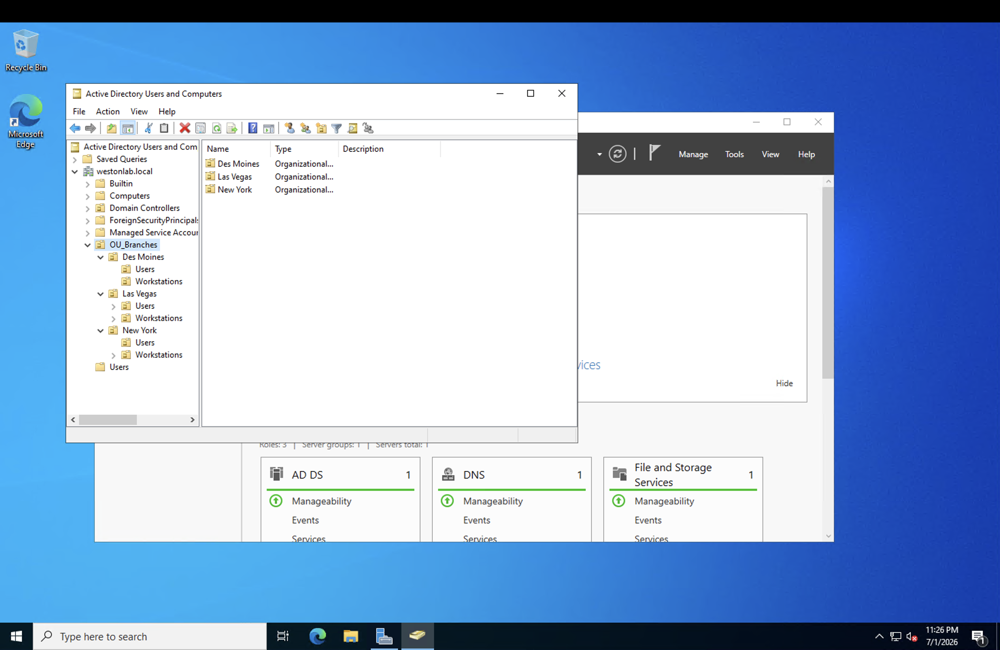

---

## 4. User and Security Group Administration

User accounts were organized by office location and departmental Security Groups were created to simulate role-based access control (RBAC).

Groups include:

- IT
- Accounting
- Human Resources

Users from multiple branches were assigned to the appropriate Security Groups rather than assigning permissions directly to individual accounts.

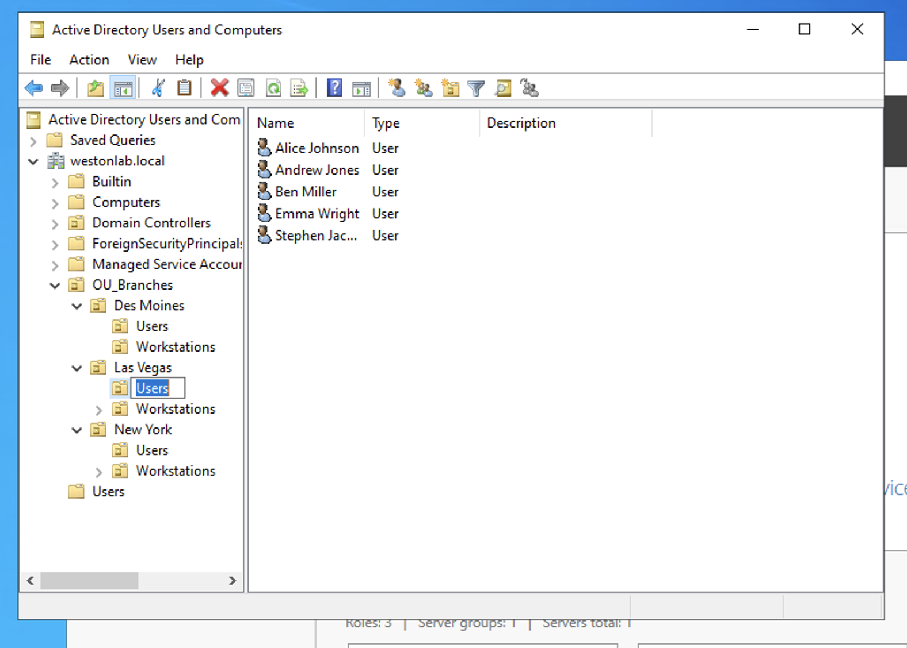

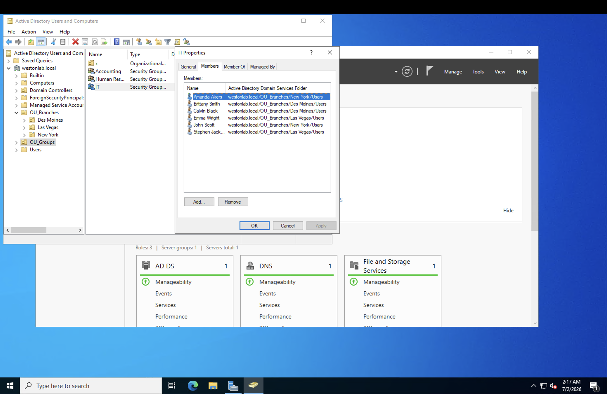

---

## 5. Group Policy Management

Centralized management was implemented through Group Policy Objects (GPOs).

Custom policies included:

- Account Lockout Policy
- Des Moines Workstation Security Baseline
- Des Moines Branch Configuration
- Network Level Authentication (NLA)

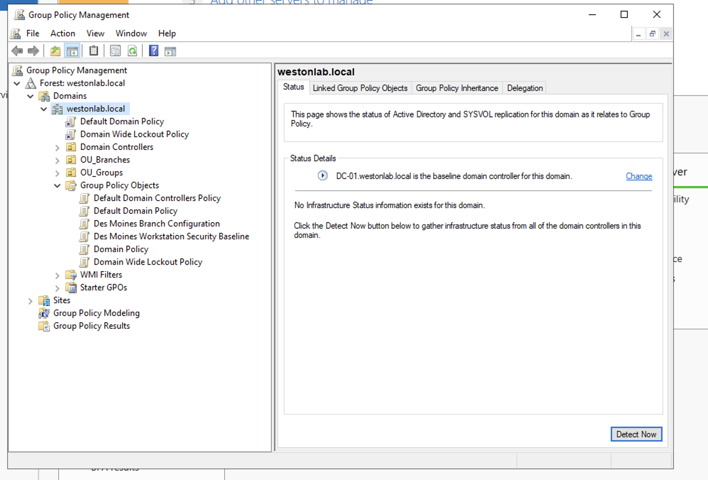

The Account Lockout Policy was configured to lock user accounts after ten failed authentication attempts.

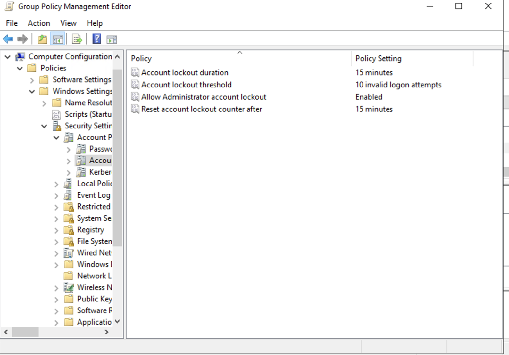

A location-specific interactive logon banner was deployed to all Des Moines workstations.

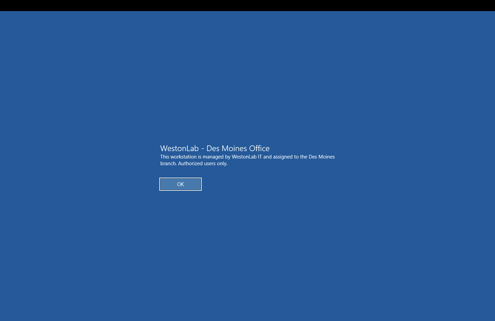

---

## 6. Client Configuration and Domain Validation

The Windows client was configured to use the Domain Controller for DNS before joining the Active Directory domain.

DNS validation confirmed successful name resolution for the domain and Domain Controller.

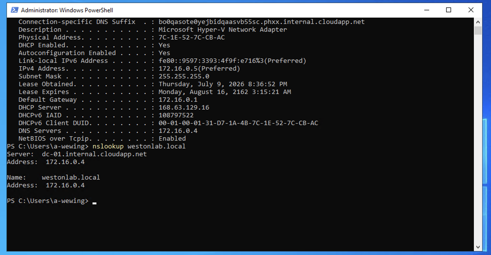

After joining the domain, authentication was validated using PowerShell.

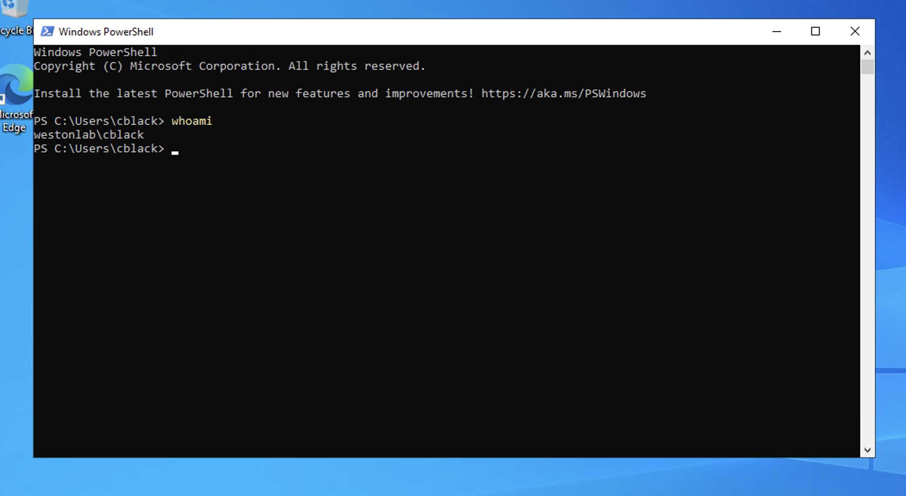

---

## 7. Security Validation

To validate the domain security policy, repeated failed Remote Desktop authentication attempts were performed.

After ten failed logon attempts, the account was automatically locked by Active Directory.

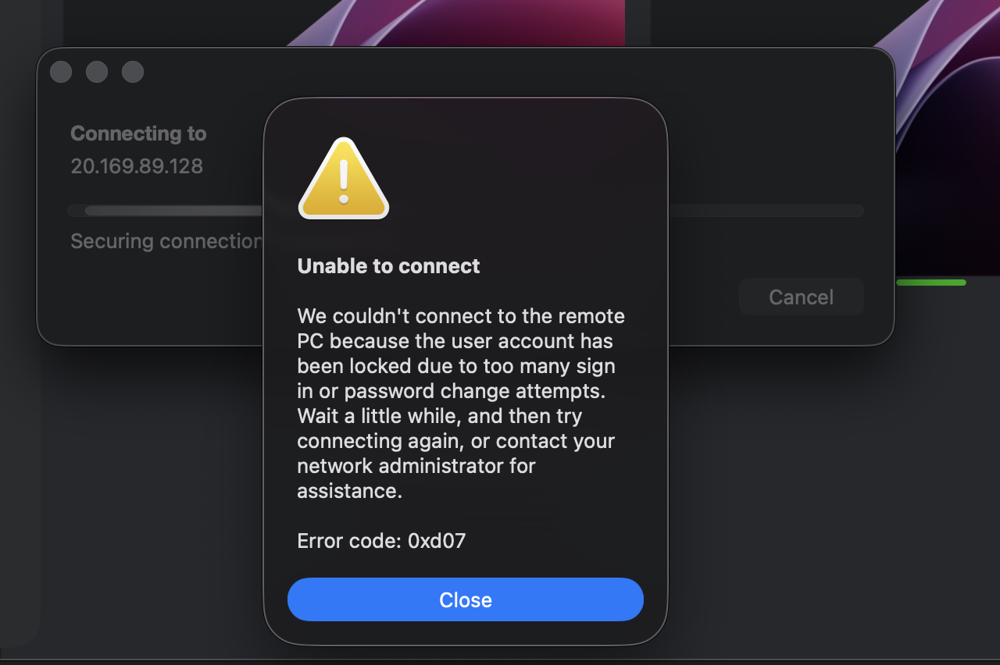

The account was then restored through Active Directory Users and Computers.

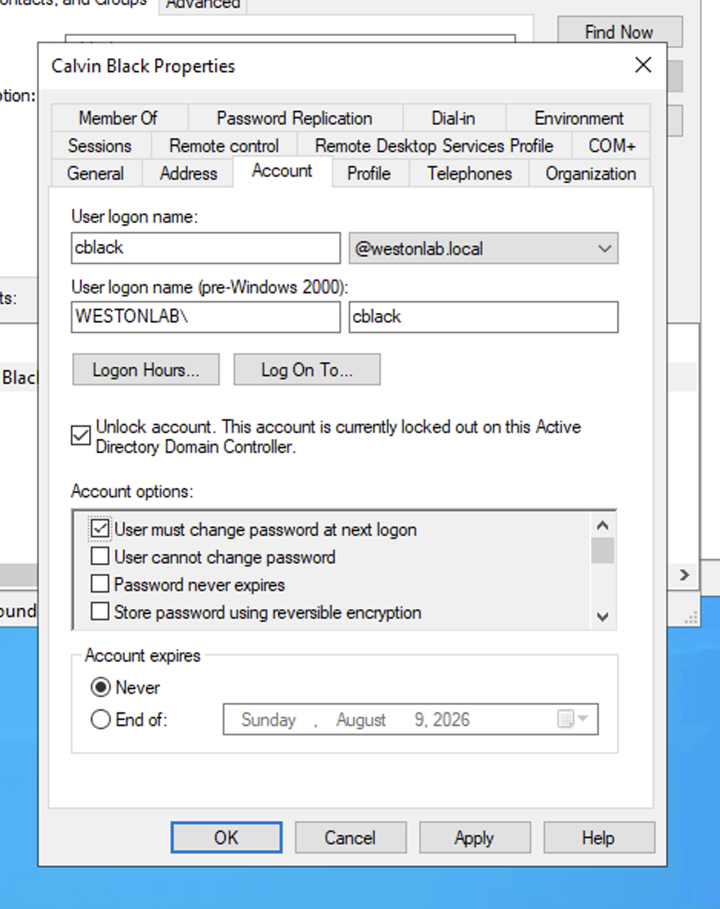

This workflow demonstrates centralized identity management and successful enforcement of the configured Group Policy security controls.

---

# Lessons Learned

This project reinforced several core concepts of enterprise Windows administration:

- Active Directory relies heavily on proper DNS configuration.
- Organizational Unit design greatly simplifies administration and policy deployment.
- Group Policy provides centralized management for security and workstation configuration.
- Security Groups should be used to assign permissions rather than individual user accounts.
- PowerShell is an effective tool for validating Active Directory and client configuration.
- Proper testing is essential to verify that security policies function as intended.

---

# Future Improvements

Future enhancements to this environment include:

- Deploying a secondary Domain Controller for redundancy
- Implementing Windows LAPS
- Configuring WSUS
- Adding a File Server
- Deploying Active Directory Certificate Services (AD CS)
- Automating user provisioning with PowerShell
- Integrating Microsoft Defender for Endpoint
- Exploring Microsoft Intune for device management

---
